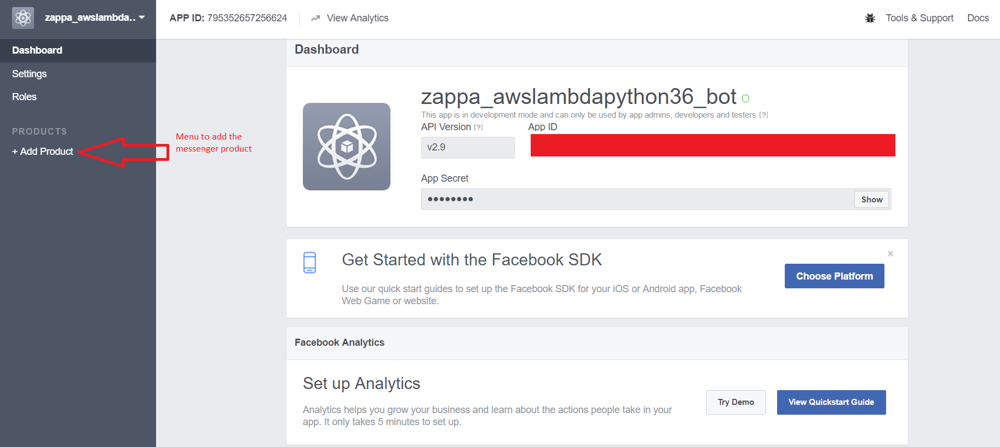

Hello reader , in this article I will explain my approach to deploy a chatbot in python on the Messenger platform.

## Genesis of the project
This idea to deploy a chatbot comes from different articles that I read on how non developer create a resume bot to assist them during their job search and have a vey nice digital and original front page.

One of the nicest example that I saw was the HireElibot

 

This chatbot that you can find on messenger , is quite cool and I wanted to make one to assist me in my future job search (or at least a skeleton for a future chatbot).

I am definitely not a proper developer ; but I am a coder (as I am a data scientist and a maker) and a python lover (a lot of colleagues try to push to use node.js for this project but I refused) so I decided to try to make my own chatbot in Python.

I tried different approaches to complete this project

### First approach : Telegram + Python

My first approach was to try to find how to deploy a chatbot in a platform and make it available on different device.

My research lead me to the course of Gareth Dwyer on [Codementor](https://www.codementor.io/garethdwyer/building-a-telegram-bot-using-python-part-1-goi5fncay).

**Opinion**:The course is really good and it gives a nice overview of the usage of the telegram api to make a very simple chatbot. I used this approach to create a weather chatbot that will used the [Google maps api](https://developers.google.com/maps/?hl=fr) and the [dark sky api](https://darksky.net/dev/) to make my [own cheap poncho like](https://github.com/jeanmidevacc/weatherforecast_telegrambot).

But it's a very simple approach (with a while loop) , and the Telegram platform is not the most popular.

So I decided to use the messenger platform and try to find the way the way to deploy the bot on a server or at least avoid the while loop with a webhook approach.

### Second approach : Messenger + Heroku + Python

In this part I preferred my research lead me to the blog of [Hartley Brody](https://blog.hartleybrody.com/) and his post ["Facebook Messenger Bot Tutorial: Step-by-Step Instructions for Building a Basic Facebook Chat Bot"](https://blog.hartleybrody.com/fb-messenger-bot/).

The article and the code are very clear , but basically the idea is to use to deploy an application that can receive the data send by the user (by the use of webhook) and answer in consequence at the interactions.

**Opinion**:The course is really clear and I am Flask defender so that's cool but the usage of Heroku in his free version is quite limited the server , I have to ping my Heroku app every 10 minutes to avoid that she fall asleep. I can pay to continue Heroku but I found the pricing quite high for just a chatbot.

Like most of my backend is stored in the Amazon Web Services (dynamodb,RDS,S3) , I try to find an approach that could help me to use the AWS structure and be to expensive and I found the perfect solution for me.

## My approach
My options on AWS to deploy the flask application were:
- EC2 instance
- Elastic beanstalk
- Lambda

The two first options was still in the same rank that Heroku in term of price and I found the Elastic beanstalk approach very restricted. So my choice went on the AWS lambda service.

 To deploy the Flask application on a lambda I have to find a dependency that permit that. Amazon has one it's call [Chalice](https://github.com/aws/chalice).I tested for some other api projects is good but I have to translate all my code from the Flask framework to the chalice framework so ...

But my research lead to me to a super alternative at chalice it called [Zappa](https://www.zappa.io/) and guess what : it's work perfectly. So to deploy a messenger chatbot in a lambda you can follow the following process (that you can find in this [github repository](https://github.com/jeanmidevacc/messenger-bot-python-flask-zappa-amazon)).

### Facebook application setup
- Setup a [Facebook application](https://developers.facebook.com) in the developer
- Add a messenger product in the application

- Create a Facebook page
- Add a "send message" button to the page

- Select the page that you have created (and accept the your profile have access blah blah)

- Keep the access token that has been assigned

### Flask application Setup
- Create a virtual environment with the command virtualenv in my case **zappa_env**
- Activate the environment `activate zappa_env`
- Install with pip `pip install zappa flask awscli`
- Clone the content of this git in a separate folder of your environment

- Replace the `access_token` in the application.py file by the access token of your application
- Create a verify token (be imaginative or not)

### Deploy the application on AWS
- You need to create a user on your AWS account that will have the administrator access
- Use the command `zappa init` in your project folder

In this tutorial you can accept the default parameter that zappa offer you to complete the process:

  1. environment name : dev
  2. S3 bucket name : random name
  3. available for all region : n

- Check if in your project folder there is a zappa_settings.json file
- Your application is now initialize so we can deploy the app with the command `zappa deploy dev`

Let's the deployment begin (chill out).

### Finish to complete the Facebook application setup
On the messenger settings page you have to setup the webhooks
- Copy paste the url of your app on the callback url field
- Add the verify_token that you created in the application.py previously
- Verify and save
- Subscribe the webhook to your facebook page events
!

### Update you application
- To finish you need to update the `verify_token` variable on the application.py files by the token that you create previously
- Update the app with the command
`zappa update dev`

### Test it

## Feedback
So with this approach you can have a Facebook messenger chatbot that you can deploy easily without a server with a very liited cost.

I hopes that this article that present my approach to deploy a chatbot will help you and if you have any remarks on my works comment at the end of the article.

## Resources
- [Gareth Dwyer course ](https://www.codementor.io/garethdwyer/building-a-telegram-bot-using-python-part-1-goi5fncay)
- [Telegram weather bot](https://github.com/jeanmidevacc/weatherforecast_telegrambot)
- [Messenger bot with Python](https://github.com/jeanmidevacc/messenger-bot-python-flask-zappa-amazon)
- [Facebook Messenger Bot Tutorial: Step-by-Step Instructions for Building a Basic Facebook Chat Bot](https://blog.hartleybrody.com/fb-messenger-bot/) by Hartley Brody
- [First step with zappa flask and Python 3](https://andrich.blog/2017/02/12/first-steps-with-aws-lambda-zappa-flask-and-python/) by Oliver Andrich
- [Zappa](https://www.zappa.io/)
